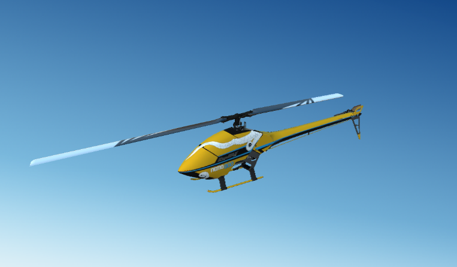

# Nemo800 Helicopter for Flightaxis SITL

Goblin style Heli model

 800mm Blades

12s, 5000mah Lipo

11.94 lb AUW

## Servo Functions:
H-1 type swashplate
* Servo1		Motor1 (Aileron Servo)
* Servo2		Motor2 (Elevator Servo)
* Servo3		Motor3 (Collective)
* Servo4		Motor4 (Tail Servo)
* Servo8		HeliRSC (Throttle)

## Parameter file/setup notes:

* AETR normal control order
* RC8 is motor interlock

