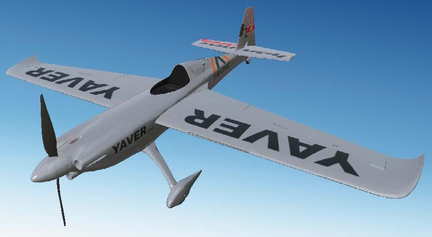

# Edge540

Aircraft Model:
3D Model By: Adrian Nagy Hinst

[3D LabPrint Store](https://3dlabprint.com/shop/zivko-edge-hannes-arch-replica/)

* Wing Span......... 46.7 (in)
* Weight............ 1.2 (kg)
* Power............. 40 electric
* Prop.............. 12x8.2
* Battery........... 6 Cell - 1300mAh - LiPo

## ArduPilot Servo Functions:
* Servo1		Aileron
* Servo2		Elevator
* Servo3		Throttle
* Servo4		Rudder

tested in RealFlight9.5 using ArduPlane 4.4dev
