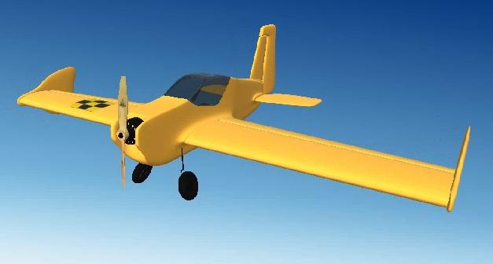

# FliteTest 3D XL

Aircraft Model:
3D Model By: Brandon MacDougall

[FliteTest Store](https://store.flitetest.com/ft-3d-xl-mkr2/)

* Wing Span......... 50 (in)
* Length............ 47 (in)
* Weight............ 2.8 (lbs)
* Power............. 40 electric
* Prop.............. Zinger 12x4.5
* Battery........... 3 Cell - 3300mAh - LiPo

## ArduPilot Servo Functions:
* Servo1		Aileron
* Servo2		Elevator
* Servo3		Throttle
* Servo4		Rudder

tested in RealFlight9.5 using ArduPlane 4.4dev
