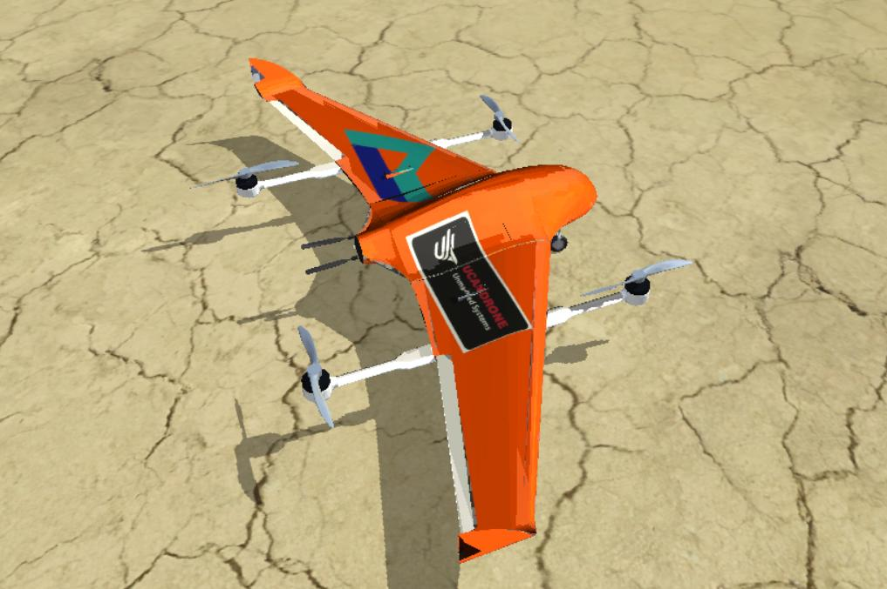

# Skywalker X8 QuadPlane

CAD and power setup: [UCanDrone S.A.](https://ucandrone.com/)
SITL model development: George Zogopoulos - [Controlled Ascent](https://controlled-ascent.com/)

## Characteristics

* Wing span: .......... 2.12 m
* Length: ............. 1.06 m
* Weight: ............. 9.82 kg
* Battery: ............ 8S3P LiPo - 26000 mAh
* Pusher thruster: .... 17"x5.8" 375KV
* MC thrusters: ....... 15"x12" T-Motor MN505-S Navigator KV380

## Ardupilot servo functions
* Servo 1       Elevon Right
* Servo 2       Elevon Left
* Servo 3       Throttle
* Servo 4       Steering
* Servo 5       Motor 1
* Servo 6       Motor 2
* Servo 7       Motor 3
* Servo 8       Motor 4
* Servo 9       Retracts

## Notes

* The retracts are controlled via RC Ch9.

Tested in RealFlight Evolution using ArduPlane 4.5.2.

